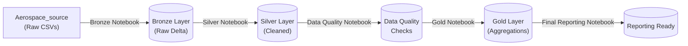

# ✈️ Aerospace Data Lakehouse Project

An enterprise-grade, end-to-end data engineering pipeline built on **Databricks**, utilizing **PySpark**, **Delta Lake**, and **Unity Catalog** to ingest, clean, validate, aggregate, and report on multi-source aerospace telemetry and operational data.

---

## 🏗️ Architecture & Notebook Structure

This project follows the **Medallion Architecture** pattern, divided into clean, modular notebooks stored in this repository:

## 📂 Repository Layout

This project is organized into modular notebooks following the Medallion Architecture pattern[cite: 5]:

* **`Aerospace_source/`** — Contains raw source datasets (`flights.csv`, `aircraft.csv`, `maintenance.csv`, `flight_sensor_data.csv`, `flight_incidents.csv`, `aerospace_flight_telemetry.csv`, `avionics_flight_displays.csv`, `cockpit_display_config.csv`)[cite: 5].
* **`Aerospace_bronze.ipynb`** — Ingests raw CSV files, infers schemas, and tags records with an ingestion timestamp into Delta tables (`workspace.default.bronze_*`)[cite: 5].
* **`Areospace_silver.ipynb`** — Standardizes formats, casts columns to proper data types (`DoubleType`, `IntegerType`, `TimestampType`), trims strings, handles nulls, and removes duplicates (`workspace.default.silver_*`)[cite: 5].
* **`Aerospace_data_quality.ipynb`** — Enforces rigorous validation rules, constraint checks, and data integrity guarantees[cite: 5].
* **`Aerospace_gold.ipynb`** — Performs advanced business-level feature engineering and multi-table aggregations (`workspace.default.gold_*`)[cite: 5].
* **`Aerospace_final_reporting.ipynb`** — Prepares final analytics-ready datasets designed to power executive summaries and monitoring dashboards[cite: 5].

---

## 🛠️ Tech Stack & Key Features

* **Processing Engine:** Apache Spark / PySpark
* **Storage Format:** Delta Lake (ensuring ACID transactions, time-travel, and reliability)
* **Data Governance:** Databricks Unity Catalog (`workspace.default.*`)
* **Quality & Engineering Controls:**
  * Automated deduplication (`dropDuplicates`) and mandatory key validation (`dropna`).
  * Explicit type casting and string whitespace normalization (`F.trim`).
  * Auditability through tracking `ingestion_timestamp` and `processed_timestamp`.

---
